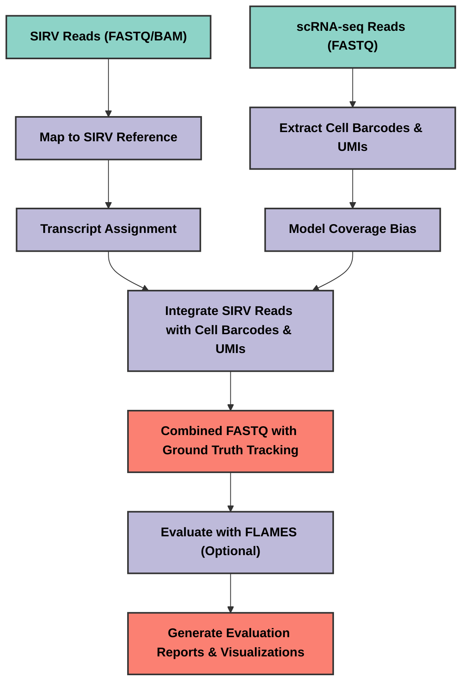

# SIRV Integration Pipeline for Long-Read scRNA-seq

A pipeline for integrating SIRV spike-in reads into existing scRNA-seq datasets to benchmark isoform discovery tools.

## Overview

This pipeline creates semi-synthetic benchmarking datasets by adding SIRV (Spike-In RNA Variant) reads to existing single-cell RNA-seq data. It provides ground truth for evaluating transcript discovery and quantification tools like FLAMES.

## Pipeline Schematic



## Key Features

- Maps SIRV reads to reference to identify transcripts of origin
- Adds cell barcodes and UMIs to SIRV reads for single-cell analysis
- Models read length distributions and 5'-3' coverage bias
- Generates tracking information for benchmarking
- Supports both FASTQ and BAM files as SIRV input

## Installation

```bash
git clone https://github.com/manveerchauhan/sirv-integration-pipeline.git
cd sirv-integration-pipeline
pip install .
```

Dependencies: Python 3.7+, numpy, pandas, matplotlib, jinja2, minimap2, samtools

## Usage

### Basic Integration

```bash
sirv-pipeline --integration \
    --sirv-fastq sirv_reads.fastq \
    --sc-fastq scRNA_data.fastq \
    --sirv-reference sirv_genome.fa \
    --sirv-gtf sirv_annotation.gtf \
    --output-dir ./output \
    --insertion-rate 0.1
```

### With Combined References

```bash
sirv-pipeline --integration \
    --sirv-fastq sirv_reads.fastq \
    --sc-fastq scRNA_data.fastq \
    --sirv-reference sirv_genome.fa \
    --sirv-gtf sirv_annotation.gtf \
    --non-sirv-reference genome.fa \
    --create-combined-reference \
    --output-dir ./output
```

### Using BAM Input

```bash
sirv-pipeline --integration \
    --sirv-bam sirv_reads.bam \
    --sc-fastq scRNA_data.fastq \
    --sirv-reference sirv_genome.fa \
    --sirv-gtf sirv_annotation.gtf \
    --output-dir ./output
```

### Evaluation Mode

```bash
sirv-pipeline --evaluation \
    --expected-file ./output/tracking.csv \
    --flames-output flames_counts.csv \
    --output-dir ./evaluation
```

## Output Files

### Integration Mode
- `integrated.fastq`: FASTQ with SIRV reads added to scRNA-seq data
- `transcript_map.csv`: Mapping of SIRV reads to transcripts
- `coverage_model.csv`: Coverage bias model
- `tracking.csv`: Tracking information for inserted reads

### Evaluation Mode
- `comparison.csv`: Expected vs. observed SIRV counts
- `plots/`: Evaluation plots (correlation, detection rate, transcript detection)
- `report.html`: Summary report
- `diagnostics/`: Additional visualizations

## Advanced Options

| Option | Description | Default |
|--------|-------------|---------|
| `--output-dir DIR` | Output directory | `./output` |
| `--insertion-rate FLOAT` | SIRV insertion rate (0-1) | `0.1` |
| `--threads INT` | Number of threads | `8` |
| `--non-sirv-reference FILE` | Path to genome reference | None |
| `--create-combined-reference` | Create combined reference | False |
| `--verbose` | Enable verbose logging | False |

## Development

### Running Tests

The repository includes test scripts to verify functionality:

```bash
# Run basic pipeline test with synthetic data
python run_test_pipeline.py

# Run complete test (integration + evaluation)
python run_complete_test.py
```

Test scripts will generate synthetic SIRV and scRNA-seq data in the `test_data/` directory.

### Adding New Features

1. Implement new functionality in appropriate modules under `sirv_pipeline/`
2. Update `main.py` to expose new features via CLI
3. Add tests for new functionality
4. Update documentation in this README

### HPC Usage

For large datasets, use the provided SLURM script:

```bash
sbatch sirv_integration_pipeline.slurm
```

Modify the script parameters in the header section as needed.

## Contact

Questions or suggestions: mschauhan@student.unimelb.edu.au
