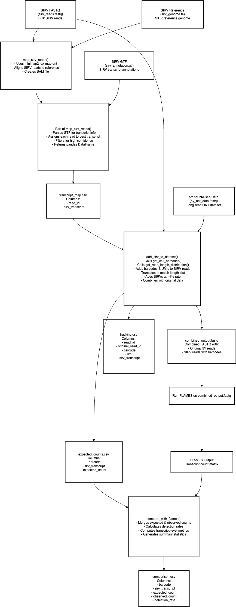

# SIRV Integration Pipeline for Long-Read scRNA-seq

A pipeline for integrating SIRV spike-in reads into existing scRNA-seq datasets to benchmark isoform discovery tools.

## Overview

This pipeline allows you to create semi-synthetic benchmarking datasets by adding SIRV (Spike-In RNA Variant) reads to an existing single-cell RNA-seq dataset. The primary purpose is to evaluate transcript discovery and quantification tools like FLAMES by providing a ground truth of known transcripts at controlled abundances.

Key features:
- Maps SIRV reads to reference to identify their transcript of origin
- Integrates SIRV reads into an existing ONT long-read scRNA-seq dataset
- Adds cell barcodes and UMIs to SIRV reads for single-cell analysis
- Models read length distributions to match the target dataset
- Models 5'-3' coverage bias to match the sequencing protocol
- Provides tracking information for expected vs. observed comparisons
- Generates detailed evaluation reports for benchmarking
- Supports both FASTQ and BAM files as input for SIRV reads

## Installation

```bash
# Clone the repository
git clone https://github.com/manveerchauhan/sirv-integration-pipeline.git
cd sirv-integration-pipeline

# Install the package
pip install .
```

## Dependencies

- Python 3.7+
- numpy, pandas, matplotlib, jinja2
- External tools: minimap2, samtools

You can install the Python dependencies via pip:

```bash
pip install numpy pandas matplotlib jinja2
```

For minimap2 and samtools, follow their installation instructions or use conda:

```bash
conda install -c bioconda minimap2 samtools
```

## Usage

The pipeline operates in two primary modes:

1. **Integration mode**: Add SIRV reads to an existing scRNA-seq dataset
2. **Evaluation mode**: Compare expected vs. observed SIRV counts (e.g., from FLAMES output)

### Integration Mode with FASTQ Input

```bash
sirv-pipeline --integration \
    --sirv-fastq sirv_reads.fastq \
    --sc-fastq scRNA_data.fastq \
    --sirv-reference sirv_genome.fa \
    --sirv-gtf sirv_annotation.gtf \
    --output-dir ./output \
    --insertion-rate 0.1
```

### Integration Mode with BAM Input

The pipeline now supports using BAM files directly as input:

```bash
sirv-pipeline --integration \
    --sirv-bam sirv_reads.bam \
    --sc-fastq scRNA_data.fastq \
    --sirv-reference sirv_genome.fa \
    --sirv-gtf sirv_annotation.gtf \
    --output-dir ./output \
    --insertion-rate 0.1
```

You can also specify multiple BAM files which will be merged:

```bash
sirv-pipeline --integration \
    --sirv-bam file1.bam file2.bam file3.bam \
    --sc-fastq scRNA_data.fastq \
    --sirv-reference sirv_genome.fa \
    --sirv-gtf sirv_annotation.gtf \
    --output-dir ./output \
    --insertion-rate 0.1
```

### Evaluation Mode

```bash
sirv-pipeline --evaluation \
    --expected-file ./output/tracking.csv \
    --flames-output flames_counts.csv \
    --output-dir ./evaluation
```

### Combined Mode

```bash
sirv-pipeline --integration --evaluation \
    --sirv-fastq sirv_reads.fastq \
    --sc-fastq scRNA_data.fastq \
    --sirv-reference sirv_genome.fa \
    --sirv-gtf sirv_annotation.gtf \
    --flames-output flames_counts.csv \
    --output-dir ./output \
    --insertion-rate 0.1
```

## 5'-3' Coverage Bias Modeling

The pipeline automatically models and applies 5'-3' coverage bias to ensure SIRV reads have realistic coverage patterns. This is crucial for creating accurate benchmarking datasets, as these coverage patterns affect isoform detection and quantification.

## Output Files

### Integration Mode
- `integrated.fastq`: The output FASTQ with SIRV reads added to scRNA-seq data
- `transcript_map.csv`: Mapping of SIRV reads to their transcripts of origin
- `coverage_model.csv`: Coverage bias model for SIRV transcripts
- `tracking.csv`: Tracking information for inserted SIRV reads

### Evaluation Mode
- `comparison.csv`: Comparison of expected vs. observed SIRV counts
- `plots/`: Directory containing evaluation plots
  - `count_correlation.png`: Scatter plot of expected vs. observed counts
  - `detection_rate.png`: Detection rate vs. expected count
  - `transcript_detection.png`: Detection rate by SIRV transcript
- `report.html`: HTML report summarizing evaluation results
- `diagnostics/`: Directory containing additional diagnostic visualizations
  - See Visualization Guide section below for details on these plots

## Visualization Guide

The pipeline generates two sets of visualizations: standard evaluation plots for benchmarking SIRV detection, and detailed diagnostic plots for analyzing the integration and coverage modeling process.

### Standard Evaluation Plots

1. **Count Correlation Plot** (`count_correlation.png`): 
   - Shows the relationship between expected SIRV counts (x-axis) and observed counts (y-axis)
   - Perfect correlation would show points along the diagonal line
   - Points below the line indicate under-counting; points above indicate over-counting
   - Quantifies accuracy of transcript quantification

2. **Detection Rate Plot** (`detection_rate.png`):
   - Displays detection status (detected=1, not detected=0) vs. expected count
   - The red trend line shows how detection probability increases with transcript abundance
   - Useful for determining detection sensitivity thresholds for your experimental design

3. **Transcript Detection Plot** (`transcript_detection.png`):
   - Bar chart of detection rates for each SIRV transcript
   - Identifies transcripts that are consistently missed or detected
   - Highlights potential sequence-specific biases in detection

### Diagnostic Visualizations

1. **Read Length Distribution** (`diagnostics/plots/read_length_distribution.png`):
   - Compares original SIRV read lengths to the sampled/modified lengths
   - Validates that length distributions match the modeling parameters
   - Dashed lines show mean lengths for each distribution

2. **Length Sampling Relationship** (`diagnostics/plots/length_sampling_relationship.png`):
   - Scatter plot of original vs. modified read lengths
   - Correlation value indicates how closely original lengths are preserved
   - Density coloring shows clustering of length transformations

3. **Truncation Distribution** (`diagnostics/plots/truncation_distribution.png`):
   - Histogram of read truncation amounts, grouped by transcript
   - Shows how much each transcript type is shortened
   - Higher truncation indicates more aggressive length modification

4. **Per-Transcript Length Distribution** (`diagnostics/plots/per_transcript_length_distribution.png`):
   - Violin plots showing length distribution for each transcript
   - Red dots indicate mean original length
   - Reveals transcript-specific length sampling behavior

5. **Coverage Bias Model** (`diagnostics/plots/coverage_bias_model.png`):
   - Heatmap showing positional coverage bias across normalized transcript positions
   - Visualizes 5' or 3' bias in the coverage model
   - Uniform color indicates even coverage; gradient indicates bias

6. **Per-Cell Integration Rate** (`diagnostics/plots/per_cell_integration_rate.png`):
   - Bar chart showing number of unique SIRV transcripts per cell
   - Demonstrates the distribution of spike-ins across cells
   - Helps validate that integration was balanced across the dataset

These visualizations help verify that the pipeline is correctly modeling read characteristics and can be used to diagnose issues with integration, coverage bias modeling, or downstream detection problems.

## Advanced Options

```bash
# Common options
--output-dir DIR        Output directory (default: ./output)
--log-file FILE         Log file path (default: <output_dir>/pipeline.log)
--verbose               Enable verbose logging

# Integration mode options
--insertion-rate FLOAT  SIRV insertion rate (0-1, default: 0.1)
```

## The Complete Pipeline Workflow

1. **Map SIRV Reads**: Map SIRV reads to reference to identify transcript of origin
2. **Model Transcript Coverage**: Learn 5'-3' coverage bias from SIRV alignments
3. **Add SIRV Reads**: Add SIRV reads with cell barcodes and realistic coverage patterns
4. **Evaluate with FLAMES**: Compare expected vs. observed transcripts from FLAMES output
5. **Generate Report**: Create visualizations and reports for benchmarking results

## Citing SIRV Integration Pipeline

If you use SIRV Integration Pipeline in your research, please cite:

```
[Citation information will be added after publication]
```

## Contributing

Contributions are welcome! Please feel free to submit a Pull Request.
Feel free to contact me for questions/suggestions: mschauhan@student.unimelb.edu.au

## Pipeline Schematic

